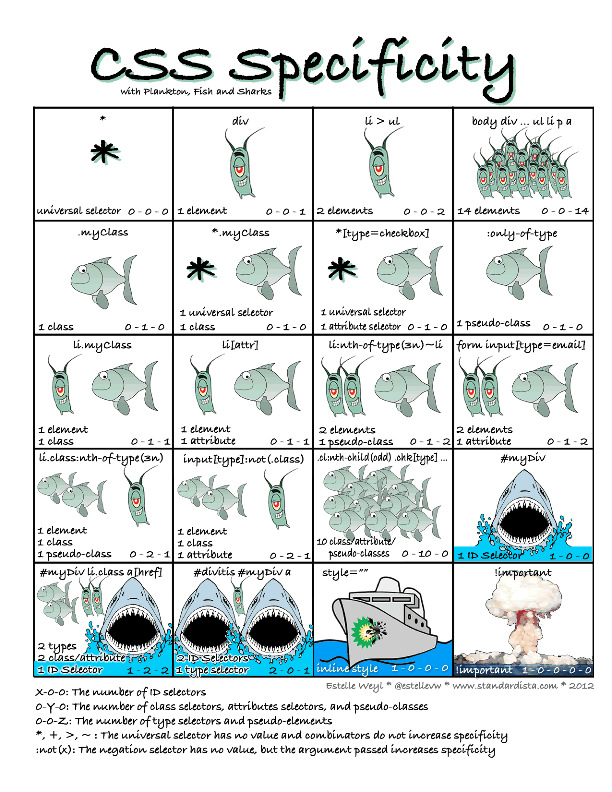

# :star: Welcome **`
`-elopers** To Session 2 :star:
---
## 1- Housekeeping
### What You Need by end of Sunday to stay in good standing and avoid `falling behind` or `warning`s
- Both Discussion Questions submitted for Week 1
- 2 Core Assignments completed and turned in: Registration Form & Plotting Our Blocks
### What to prepare for Monday's class
- read up to `Flex Advantage` in CSS module
### Always Validate your HTML code
---
...Quick recap...
## 0- HTML Practice in Groups 5 min
- Practice identifying HTML tags
- Write comments
  - img alt
- semantics -> screen readers -> accessibility
---
## 0.5- Review answers together
- answer page
---
### 0.9- Hope you came prepared with reading!
## 1- CSS Prep - What does CSS do and look like?
- Fast Forward: apply css to the quiz and see overview
- side by side html and css compare:
  - what kind of patterns do you notice?
  - how does css know what to target?
  - how far can they "reach"?
  - how can we use id and class to improve the code?
---
## 1.5- CSS Intro
- Link to CSS in HTML
  - 3 ways...
  - Which is Best practice? why?
- Selecting tags using CSS
  - id vs class vs just element
  - what order?
    - the more specific and unique it is, apply class and id accordingly
- CSS Properties
  - start with reset
- Sizes 
- Box Model
  - margin, padding, border
  - top, right, bottom, left
- Display: Inline, Block, and Inline-Block
- Selector Specificity

    
 Click for Image 

    

- ***Trying out for band starter HTML***
---

## 2- Stuff to check out
- CSS Diner - Game someone made to help practice CSS using food
---
